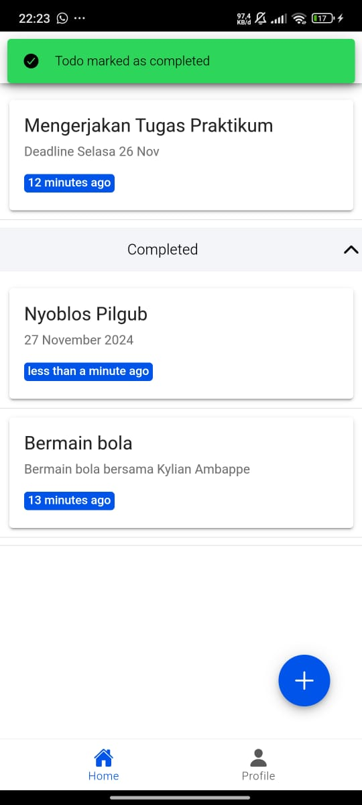

# **Proses CRUD (Create, Read, Update, Delete) Data Todo**

#### 1. **Konfigurasi Firebase Firestore**
Firebase Firestore digunakan untuk menyimpan data todo. Konfigurasi Firebase disiapkan di file `firebase.ts`.

```typescript
import { initializeApp } from "firebase/app";
import { getFirestore } from 'firebase/firestore';

const firebaseConfig = {
    apiKey: "API_KEY",
    authDomain: "PROJECT_ID.firebaseapp.com",
    projectId: "PROJECT_ID",
    storageBucket: "PROJECT_ID.appspot.com",
    messagingSenderId: "SENDER_ID",
    appId: "APP_ID"
};

const firebase = initializeApp(firebaseConfig);
const db = getFirestore(firebase);

export { db };
```
**Penjelasan:**  
- `initializeApp` menginisialisasi Firebase di aplikasi.
- `getFirestore` digunakan untuk mendapatkan referensi ke Firestore.

---

#### 2. **Menambah Todo (Create)**
Proses menambahkan todo baru dilakukan dengan menggunakan `addDoc()` di Firestore.

```typescript
async addTodo(todo: Omit<Todo, 'id' | 'createdAt' | 'updatedAt'>) {
    try {
        const todoRef = collection(db, 'todos');
        const docRef = await addDoc(todoRef, {
            title: todo.title,
            description: todo.description,
            status: false,
            createdAt: Timestamp.now(),
            updatedAt: Timestamp.now()
        });
        return docRef.id;
    } catch (error) {
        console.error('Error Menambah Todo:', error);
        throw error;
    }
}
```
**Penjelasan:**  
- Menggunakan `collection()` untuk mendapatkan referensi ke koleksi 'todos'.
- `addDoc()` digunakan untuk menambahkan dokumen baru dengan data todo.
- Mengembalikan ID dokumen yang baru dibuat.

---

#### 3. **Membaca Todo (Read)**
Proses membaca semua todo dilakukan dengan menggunakan `getDocs()` di Firestore.

```typescript
async getTodos(): Promise<Todo[]> {
    try {
        const todoRef = collection(db, 'todos');
        const q = query(todoRef, orderBy('updatedAt', 'desc'));
        const snapshot = await getDocs(q);
        return snapshot.docs.map((doc) => ({
            id: doc.id,
            title: doc.data().title,
            description: doc.data().description,
            status: doc.data().status,
            createdAt: doc.data().createdAt,
            updatedAt: doc.data().updatedAt
        }));
    } catch (error) {
        console.error('Error Mendapatkan Todos:', error);
        throw error;
    }
}
```
**Penjelasan:**  
- Menggunakan `collection()` untuk mendapatkan referensi ke koleksi 'todos'.
- `query()` dan `orderBy()` digunakan untuk mengurutkan todo berdasarkan `updatedAt`.
- `getDocs()` digunakan untuk mengambil snapshot dokumen.
- Mentransformasi data dokumen menjadi array of Todo.

---

#### 4. **Memperbarui Todo (Update)**
Proses memperbarui data todo dilakukan dengan menggunakan `updateDoc()` di Firestore.

```typescript
async updateTodo(id: string, todo: Partial<Omit<Todo, 'id' | 'createdAt' | 'updatedAt'>>) {
    try {
        const todoRef = collection(db, 'todos');
        const docRef = doc(todoRef, id);
        await updateDoc(docRef, {
            title: todo.title,
            description: todo.description,
            updatedAt: Timestamp.now()
        });
    } catch (error) {
        console.error('Error Memperbarui Todo:', error);
        throw error;
    }
}
```
**Penjelasan:**  
- Menggunakan `collection()` untuk mendapatkan referensi ke koleksi 'todos'.
- `doc()` digunakan untuk mendapatkan referensi dokumen berdasarkan ID.
- `updateDoc()` digunakan untuk memperbarui data todo pada dokumen.
- `updatedAt` akan diperbarui secara otomatis.

---

#### 5. **Menghapus Todo (Delete)**
Proses menghapus todo dilakukan dengan menggunakan `deleteDoc()` di Firestore.

```typescript
async deleteTodo(id: string) {
    try {
        const todoRef = collection(db, 'todos');
        const docRef = doc(todoRef, id);
        await deleteDoc(docRef);
    } catch (error) {
        console.error('Error Menghapus Todo:', error);
        throw error;
    }
}
```
**Penjelasan:**  
- Menggunakan `collection()` untuk mendapatkan referensi ke koleksi 'todos'.
- `doc()` digunakan untuk mendapatkan referensi dokumen berdasarkan ID.
- `deleteDoc()` digunakan untuk menghapus dokumen todo.

---

### **Alur Utama**
1. **Tambah Todo**: Pengguna menambahkan todo baru menggunakan `addTodo()`.
2. **Baca Todo**: Pengguna membaca semua todo menggunakan `getTodos()`.
3. **Perbarui Todo**: Pengguna memperbarui data todo menggunakan `updateTodo()`.
4. **Hapus Todo**: Pengguna menghapus todo menggunakan `deleteTodo()`.

# **Build Apk**

#### 1. Instal Dependensi

Pastikan Anda berada di direktori proyek Ionic Anda. Jalankan perintah berikut untuk menginstal dependensi yang diperlukan:

```bash
npm install
```

#### 2. Menyiapkan Platform Android

Untuk menambahkan platform Android ke proyek Ionic, jalankan perintah berikut:

```bash
ionic capacitor add android
```

Jika Anda sudah menambahkan platform Android sebelumnya, Anda bisa melewati langkah ini.

#### 3. Membangun APK

Setelah platform Android ditambahkan, proses build dapat dimulai dengan menjalankan perintah berikut:

```bash
ionic build
```

Perintah ini akan membangun aplikasi web. Setelah itu, jalankan perintah berikut untuk membangun aplikasi Android:

```bash
ionic capacitor copy android
```

#### 4. Membuka Android Studio

Untuk membangun APK dari Android Studio, jalankan perintah berikut:

```bash
ionic capacitor open android
```

Perintah ini akan membuka proyek Android Anda di Android Studio.

#### 5. Membuka console firebase 

1. pergi ke project setting lalu klik tambah app
2. Masukkan package name, app nickname, dan sha-1
3. Unduh google-service.json lalu input file ke dalam projek/src/app
4. Masukkan kode yang telah disediakan pada console firebase ke dalam projek

#### 6. Membuat APK

Setelah Android Studio terbuka, ikuti langkah berikut:

1. Pilih menu **Build** > **Build APK**.
2. Proses build akan dimulai. Tunggu hingga selesai.
3. Setelah build selesai, APK yang dihasilkan dapat ditemukan di folder `android/app/build/outputs/apk/`.

#### 7. Menjalankan APK di Perangkat

Setelah APK selesai dibangun, Anda dapat menginstal APK tersebut di perangkat Android untuk pengujian.

Untuk menginstalnya bisa menggunakan perintah ADB (Android Debug Bridge) dari terminal:

```bash
adb install android/app/build/outputs/apk/debug/app-debug.apk
```


### Screenshot Hasil
Tampilan Icon Aplikasi


Tampilan Login


Tampilan Home


Tampilan Profil Pengguna


Tampilan Tambah Todo


Tampilan Edit Todo


Tampilan Hapus Todo


Tampilan Complete



