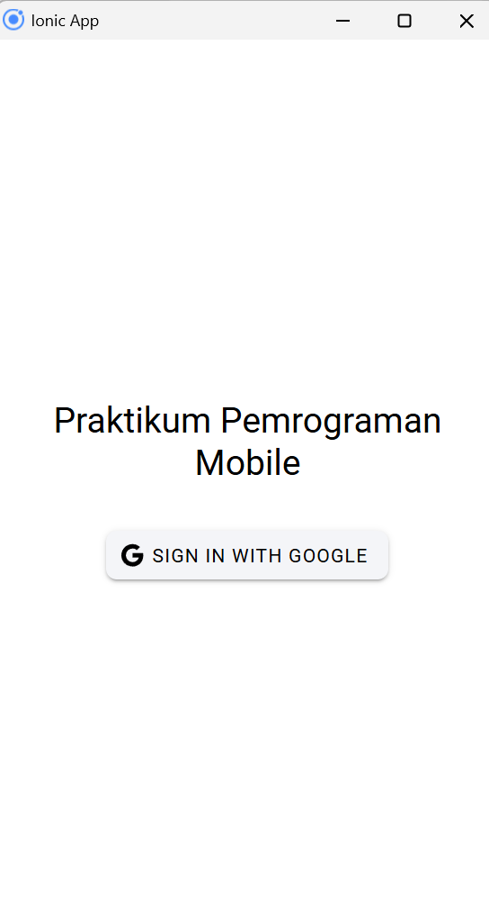
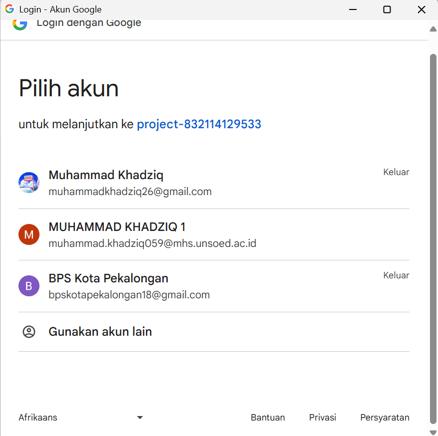
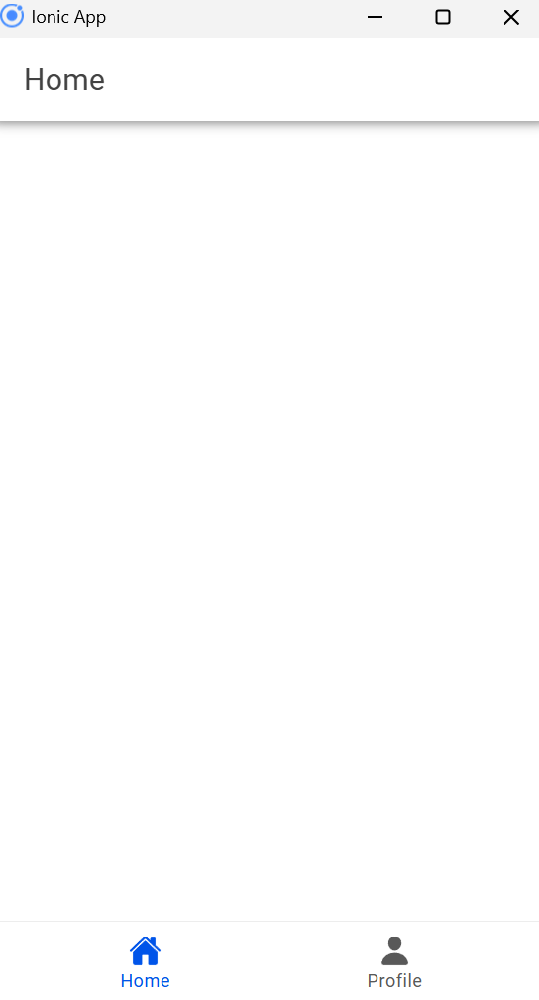
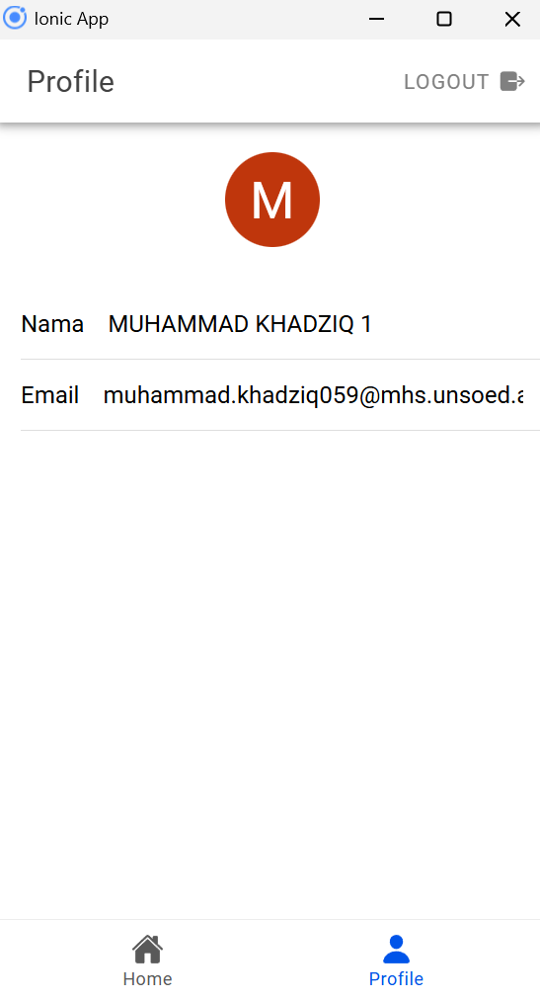

### **Proses Autentikasi Login dengan Google dan Mendapatkan Profil**

#### 1. **Konfigurasi Firebase**
Firebase digunakan untuk autentikasi login dengan Google. Konfigurasi Firebase disiapkan di file `firebase.ts`.

```typescript
import { initializeApp } from "firebase/app";
import { getAuth, GoogleAuthProvider } from 'firebase/auth';

const firebaseConfig = {
    apiKey: "API_KEY",
    authDomain: "PROJECT_ID.firebaseapp.com",
    projectId: "PROJECT_ID",
    storageBucket: "PROJECT_ID.appspot.com",
    messagingSenderId: "SENDER_ID",
    appId: "APP_ID"
};

const firebase = initializeApp(firebaseConfig);
const auth = getAuth(firebase);
const googleProvider = new GoogleAuthProvider();

export { auth, googleProvider };
```
**Penjelasan:**  
- `initializeApp` menginisialisasi Firebase di aplikasi.
- `getAuth` dan `GoogleAuthProvider` digunakan untuk autentikasi menggunakan Google.

---

#### 2. **Login dengan Google**
Proses login dilakukan dengan memanfaatkan Google Auth dan Firebase Auth.

```typescript
const loginWithGoogle = async () => {
    try {
        await GoogleAuth.initialize({
            clientId: 'GOOGLE_CLIENT_ID',
            scopes: ['profile', 'email'],
            grantOfflineAccess: true,
        });

        const googleUser = await GoogleAuth.signIn();
        const idToken = googleUser.authentication.idToken;
        const credential = GoogleAuthProvider.credential(idToken);

        const result = await signInWithCredential(auth, credential);
        user.value = result.user; // Menyimpan data pengguna
        router.push("/home"); // Arahkan ke halaman utama
    } catch (error) {
        console.error("Google sign-in error:", error);
        throw error;
    }
};
```
**Penjelasan:**  
- **Inisialisasi Google Auth**: Mengatur `clientId` dan cakupan data (`profile` dan `email`).
- **Token dan Kredensial**: `idToken` digunakan untuk mendapatkan kredensial Firebase.
- **Login Firebase**: `signInWithCredential` mengautentikasi pengguna di Firebase.

---

#### 3. **Menyimpan dan Mendapatkan Status Login**
Saat aplikasi dimulai, Firebase akan memeriksa apakah pengguna sudah login.

```typescript
onAuthStateChanged(auth, (currentUser) => {
    user.value = currentUser; // Menyimpan status pengguna
});
```
**Penjelasan:**  
- `onAuthStateChanged` memantau perubahan status login dan menyimpan data pengguna ke variabel `user`.

---

#### 4. **Mengelola Navigasi Berdasarkan Status Login**
Navigasi diatur untuk memastikan pengguna yang tidak login diarahkan ke halaman login.

```typescript
router.beforeEach(async (to, from, next) => {
    const authStore = useAuthStore();

    if (authStore.user === null) {
        await new Promise<void>((resolve) => {
            const unsubscribe = onAuthStateChanged(auth, () => {
                resolve();
                unsubscribe();
            });
        });
    }

    if (to.path === '/login' && authStore.isAuth) {
        next('/home'); // Pengguna login diarahkan ke home
    } else if (to.meta.isAuth && !authStore.isAuth) {
        next('/login'); // Pengguna belum login diarahkan ke login
    } else {
        next();
    }
});
```
**Penjelasan:**  
- Navigasi diperiksa dengan `beforeEach` untuk mengecek status autentikasi.
- Jika pengguna belum login, mereka diarahkan ke halaman login.

---

#### 5. **Menampilkan Profil Pengguna**
Profil pengguna yang diperoleh dari Firebase ditampilkan di halaman profil.

```vue
<ion-list>
    <ion-item>
        <ion-input label="Nama" :value="user?.displayName" :readonly="true"></ion-input>
    </ion-item>
    <ion-item>
        <ion-input label="Email" :value="user?.email" :readonly="true"></ion-input>
    </ion-item>
</ion-list>
```

```typescript
const user = computed(() => authStore.user); // Data pengguna dari Firebase
```
**Penjelasan:**  
- `user?.displayName` menampilkan nama pengguna.
- `user?.email` menampilkan email pengguna.

---

#### 6. **Logout**
Pengguna dapat keluar dari aplikasi dengan menghapus status login.

```typescript
const logout = async () => {
    try {
        await signOut(auth); // Logout dari Firebase
        await GoogleAuth.signOut(); // Logout dari Google
        user.value = null;
        router.replace("/login"); // Arahkan ke halaman login
    } catch (error) {
        console.error("Sign-out error:", error);
        throw error;
    }
};
```
**Penjelasan:**  
- `signOut` menghapus status login di Firebase dan Google.
- Pengguna diarahkan kembali ke halaman login.

---

### **Alur Utama**
1. **Login**: Pengguna melakukan login dengan Google melalui `loginWithGoogle`.
2. **Sinkronisasi Status**: Firebase memantau status login dengan `onAuthStateChanged`.
3. **Navigasi**: Berdasarkan status login, pengguna diarahkan ke halaman tertentu.
4. **Profil**: Data nama dan email pengguna diambil dari Firebase dan ditampilkan.
5. **Logout**: Menghapus status login dengan `logout`.

### Screenshot Hasil
Tampilan Awal



Tampilan Pilih Akun



Tampilan Home



Tampilan Profil Pengguna


